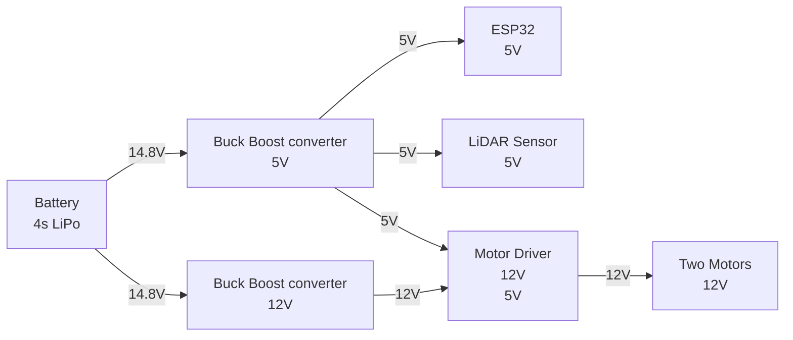

Power Path

```mermaid
flowchart LR
    BAT["Battery<br/>4s LiPo"]

    BUCK["Buck Boost converter<br/>12V"]
    B["Buck Boost converter<br/>5V"]

    ESP["ESP32<br/>5V"]
    LIDAR["LiDAR Sensor<br/>5V"]
    L298N["Motor Driver<br/>12V<br/>5V"]
    MOTORS["Two Motors<br/>12V"]

    BAT -->|14.8V| BUCK
    BAT -->|14.8V| B
    BUCK -->|12V| L298N
    L298N -->|12V| MOTORS
    B -->|5V| ESP
    B -->|5V| L298N
    B -->|5V| LIDAR
```
