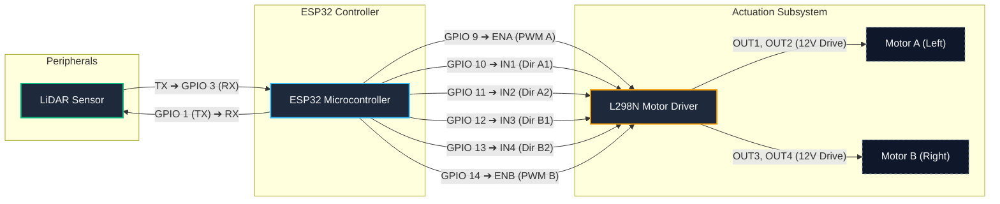

## Signal Path

```mermaid
flowchart LR
    subgraph SENSORS ["Peripherals"]
        LIDAR["LiDAR Sensor"]
    end

    subgraph MCU ["ESP32 Controller"]
        ESP["ESP32 Microcontroller"]
    end

    subgraph DRIVER ["Actuation Subsystem"]
        L298N["L298N Motor Driver"]
        M1["Motor A (Left)"]
        M2["Motor B (Right)"]
    end

    %% LiDAR Serial Lines
    ESP -- "GPIO 1 (TX) ➔ RX" --> LIDAR
    LIDAR -- "TX ➔ GPIO 3 (RX)" --> ESP

    %% Motor Control Logic & PWM
    ESP -- "GPIO 9 ➔ ENA (PWM A)" --> L298N
    ESP -- "GPIO 10 ➔ IN1 (Dir A1)" --> L298N
    ESP -- "GPIO 11 ➔ IN2 (Dir A2)" --> L298N
    ESP -- "GPIO 12 ➔ IN3 (Dir B1)" --> L298N
    ESP -- "GPIO 13 ➔ IN4 (Dir B2)" --> L298N
    ESP -- "GPIO 14 ➔ ENB (PWM B)" --> L298N

    %% Motor Power Drive Outputs
    L298N -- "OUT1, OUT2 (12V Drive)" --> M1
    L298N -- "OUT3, OUT4 (12V Drive)" --> M2

    %% Styling
    classDef mcu fill:#1e293b,stroke:#38bdf8,stroke-width:2px,color:#f8fafc;
    classDef driver fill:#1e293b,stroke:#f59e0b,stroke-width:2px,color:#f8fafc;
    classDef sensor fill:#1e293b,stroke:#10b981,stroke-width:2px,color:#f8fafc;
    classDef motor fill:#0f172a,stroke:#94a3b8,stroke-dasharray: 4 4,color:#f8fafc;

    class ESP mcu;
    class L298N driver;
    class LIDAR sensor;
    class M1,M2 motor;
```
